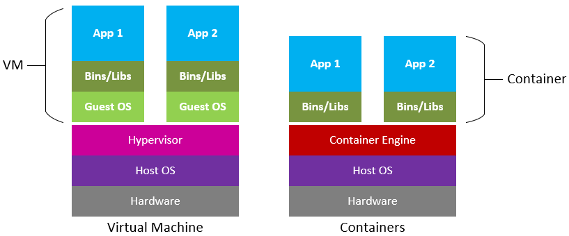
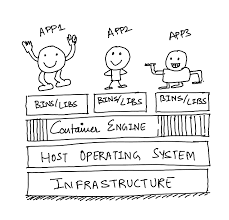
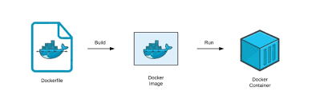

# Conatiners (OpenShift vs Kubernetes) 📦

 

# What and Why ❓
* Old Technology
* Problem
* Overcoming Issue

## Old Technology

Let's start the discussion by imagining you as a **DEVELOPER**, who is working on building a new application using Python as the programming language. In order to make the application you choose **WindowsOS** as the operating system. Just because we assumed that you are a good Developer and finally able to develop the application. Now what if you want to run the same application in other OS? You have to change the code and make it compatible with the new OS, **Right?**

 

## Problem

So, Earlier when the developer develops something for any particular OS or platform. He/She has to think about dependecies or support for other platforms. `What if the program is not supported on the platform?` The developer has to think about the solution or different solutions. Program might require some additional libraries or frameworks. `What if the library is not available?` There are a lot of possible ways where a program or application might fail. 

> 💡 This is a bad new, when you are struggling hard to find a solution

 

### Overcoming Issue

Here comes the **container** in the image. Containers require less system resources than traditional or hardware virtual machine environments because they don't include operating system images. Applications running in containers can be deployed easily to multiple different operating systems and hardware platforms.

> 😕 Is this too much ? Let's break it down then.

 

# About Technology 🧑‍💻

Containers are executable units of software in which application code is packaged, along with its libraries and dependencies, in common ways so that it can be run anywhere, whether it be on desktop, servers, or the cloud.

Containers are small, fast, and portable because unlike a virtual machine, containers do not need include a OS in every instance and can, instead, simply leverage the features and resources of the host OS.

 

 

# Scope 🔎

* ### `Migration of Resources`
     Some organizations use containers to migrate existing applications into other environments. While this practice delivers some of the basic benefits of operating system virtualization.

* ### `Develop container-native applications`
    Containers are a great way to develop applications that can be deployed to multiple operating systems and hardware platforms.

* ### `Provide DevOps Support`
    Containers are a great way to provide DevOps support for existing applications.

* ### `Provide Easy Deployment`
    Containers provide a simple deployment mechanism which allow you to deploy and run the application without any additional configuration.

* ### `Better architecture support`
    Containers are supported by many different architectures, as it allows you to run the application on different hardware platforms.

 

# Deep Dive 

There are lot to learn in **Docker**. Let's see some of the topics and get the idea of it. 🙂

 

This is a simple architecture of a docker container. You can see how app are independent of each other. Container really help to isolate the application from the host OS.

Here is a Docker concept that allows a application or executable program to build as Docker container.